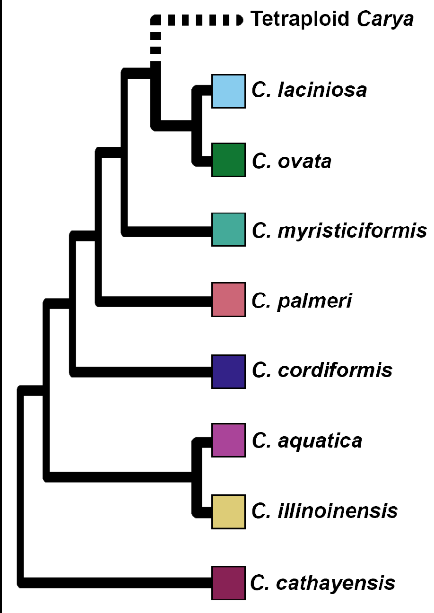
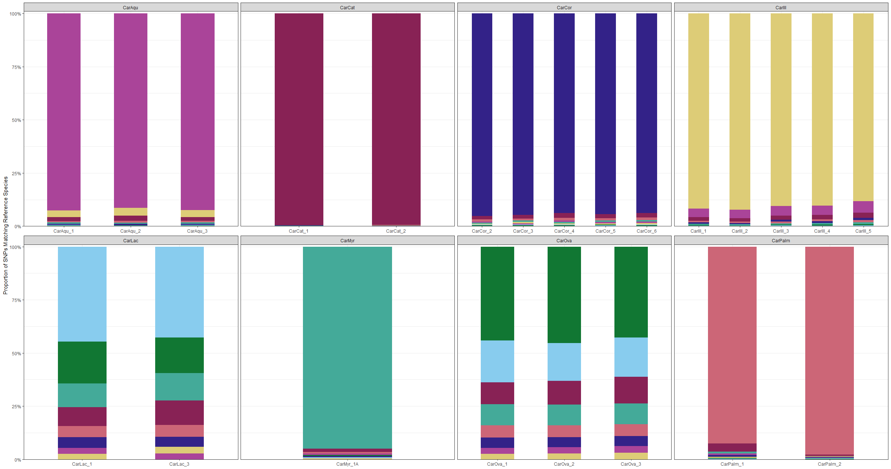

# Reference-free discovery of millions of SNPs permits species and hybrid identification in Carya (Hickory)  
## Robert Literman, Brittany M. Ott, Jun Wen, LJ Grauke, Rachel Schwartz, Sara M. Handy

## Pre-Note
This is a walkthrough of this manuscript, and is not meant as step-by-step code/script instructions. To run SISRS and generate orthologs and singletons, you can follow the SISRS walkthrough (). After you have done that, you can jump back in here at **Step X** to get a sense of the data analysis steps. A user-friendly version of this **entire** pipeline is currently under development, but all scripts are provided here.  

## Manuscript Walkthrough

### 01) Study Data  
In this manuscript, we apply the SISRS (CITE) bioinformatics pipeline to generate millions of species-identifying single-nucleotide polymorphisms (**SNPs**) for diploid *Carya* (pecan and hickory), using only low-coverage, Illumina short-read data (i.e. genome skims). Samples from this study can be broken down into three groups:  

1) **Species samples**: Genome skim data for 8 species of diploid *Carya*  

    - *Carya aquatica* (CarAqu; bitter pecan): n = 3  
    - *Carya cathayensis* (CarCat; Chinese hickory): n = 2  
    - *Carya cordiformis* (CarCor; bitternut hickory): n = 5  
    - *Carya illinoinensis* (CarIll; pecan): n = 5  
    - *Carya laciniosa* (CarLac; shellbark hickory): n = 2  
    - *Carya myristiciformis* (CarMyr; nutmeg hickory): n = 1  
    - *Carya ovata* (CarOva; shagbark hickory): n = 3  
    - *Carya palmeri* (CarPalm; Mexican hickory): n = 2  

2) **Hybrid crosses**: Genome skim data for crosses between diploid *Carya* species. There were 5 examples of crosses between pecan (*C. illinoinensis*) and one other diploid *Carya*:  

    - *C. illinoinensis* x *C. aquatica* (xlc): n = 4  
    - *C. illinoinensis* x *C. cordiformis* (xbr; *Carya x brownii*): n = 3  
    - *C. illinoinensis* x *C. laciniosa* (xnuss; *Carya x nussbaumeri*): n = 1  
    - *C. illinoinensis* x *C. myristiciformis* (myrxill): n = 1  
    - *C. illinoinensis* x *C. ovata* (xio; ‘Henke’s Hican’): n = 1  

    There were also two crosses where one of the two parents were putative hybrids:  

    - *C. x brownii* x *C. laciniosa* (xbrl): n = 1  
    - *C. x laneyi* (*C. ovata* x *C. cordiformis*) x *C. illinoinensis* (xila): n = 2  

3) **Companion Species**: One set of independent, higher-depth sequencing runs for each of the 8 diploid *Carya* species.  

    - *Carya aquatica*: SRR6804841  
    - *Carya cathayensis*: SRR6784938  
    - *Carya cordiformis* SRR6804840  
    - *Carya illinoinensis*: SRR6793970  
    - *Carya laciniosa*: SRR6804855   
    - *Carya myristiciformis*: SRR6804845  
    - *Carya ovata*: SRR6804843  
    - *Carya palmeri*: SRR6804847   

### 02) Read Preparation  
All reads were trimmed and processed identically.  

1) **Read merging**: Paired-end reads were merged using *bbmerge* from the *BBMap* suite (https://jgi.doe.gov/data-and-tools/bbtools/bb-tools-user-guide/bbmap-guide/).  

```
bbmerge.sh in=<SAMPLE>_Raw_R1.fastq.gz in2=<SAMPLE>_Raw_R2.fastq.gz outa=<SAMPLE>_Adapters.fa outm=<SAMPLE>_Merged_Raw.fastq.gz outu=<SAMPLE>_Unmerged_Raw_1.fastq.gz outu2=<SAMPLE>_Unmerged_Raw_2.fastq.gz
```

2) **Adapter trimming**: Reads were adapter-trimmed using *bbduk*.  

```
bbduk.sh ref=<SAMPLE>_Adapters_BBMap.fa ktrim=r in=<SAMPLE>_Raw_R1.fastq.gz in2=<SAMPLE>_Raw_R2.fastq.gz out=<SAMPLE>_Adapter_Trim_1.fastq.gz out2=<SAMPLE>_Adapter_Trim_2.fastq.gz
```

3) **Chloroplast assembly**: Adapter-trimmed reads were used to generate chloroplast assemblies for each sample using *getOrganelle* (https://github.com/Kinggerm/GetOrganelle).  

```
get_organelle_from_reads.py -1 <SAMPLE>_Unmerged_Adapter_Trim_1.fastq.gz -2 <SAMPLE>_Unmerged_Adapter_Trim_2.fastq.gz -u <SAMPLE>_Merged_Adapter_Trim.fastq.gz -t 20 -o <DIR>/<SAMPLE> -F embplant_pt -R 50 -k 21,45,65,85,105
```

4) **Quality-trimming**: Reads were quality-trimmed using *bbduk*.  

```
bbduk.sh ref=<SAMPLE>_Adapters_BBMap.fa qtrim=w ktrim=r trimq=10 maq=15 minlength=50 in=<SAMPLE>_Adapter_Trim_1.fastq.gz in2=<SAMPLE>_Adapter_Trim_2.fastq.gz out=<SAMPLE>_Trim_1.fastq.gz out2=<SAMPLE>_Trim_2.fastq.gz
```

5) **Nuclear read separation**: Reads were mapped against the pooled chloroplast assemblies from Step 3 above using *bbmap*, and any reads that mapped were removed from the dataset leaving predominantly nuclear reads.  

```
bbmap.sh in=<SAMPLE>_Trim_1.fastq.gz in2=<SAMPLE>_Trim_2.fastq.gz ambiguous=all threads=20 outm=Chloroplast_Reads/<SAMPLE>_Chloroplast_Trim_1.fastq.gz outm2=Chloroplast_Reads/<SAMPLE>_Chloroplast_Trim_2.fastq.gz outu=Nuclear_Reads/<SAMPLE>_Nuclear_Trim_1.fastq.gz outu2=Nuclear_Reads/<SAMPLE>_Nuclear_Trim_2.fastq.gz
```

**Results**:  
| **Study_ID**  | **Dataset**   | **Organism_Type** | **Sample_Type** | **Total_Trim_Bases** | **Nuclear_Trim_Bases** | **Percent_Nuclear** | **Nuclear_Coverage** |
|---------------|---------------|-------------------|-----------------|----------------------|------------------------|---------------------|----------------------|
| CarAqu        | Study         | Species           | Species         | 2,906,351,845        | 2,819,882,985          | 97%                 | 3.76                 |
| CarCat        | Study         | Species           | Species         | 3,328,074,932        | 3,148,712,883          | 95%                 | 4.20                 |
| CarCor        | Study         | Species           | Species         | 3,513,587,342        | 3,379,188,051          | 96%                 | 4.51                 |
| CarIll        | Study         | Species           | Species         | 4,140,494,431        | 4,061,837,481          | 98%                 | 5.42                 |
| CarLac        | Study         | Species           | Species         | 1,512,372,923        | 1,486,027,288          | 98%                 | 1.98                 |
| CarMyr        | Study         | Species           | Species         | 856,140,514          | 839,708,135            | 98%                 | 1.12                 |
| CarOva        | Study         | Species           | Species         | 2,427,825,202        | 2,370,364,475          | 98%                 | 3.16                 |
| CarPalm       | Study         | Species           | Species         | 1,099,075,171        | 1,084,591,557          | 99%                 | 1.45                 |
| CarAqu        | Companion     | Species           | Species         | 6,316,210,051        | 6,152,118,179          | 97%                 | 8.20                 |
| CarCat        | Companion     | Species           | Species         | 7,776,358,214        | 7,455,973,085          | 96%                 | 9.94                 |
| CarCor        | Companion     | Species           | Species         | 7,711,983,355        | 7,577,602,373          | 98%                 | 10.10                |
| CarIll        | Companion     | Species           | Species         | 5,979,862,916        | 5,864,294,842          | 98%                 | 7.82                 |
| CarLac        | Companion     | Species           | Species         | 4,714,724,473        | 4,636,123,901          | 98%                 | 6.18                 |
| CarMyr        | Companion     | Species           | Species         | 5,211,862,708        | 5,083,260,783          | 98%                 | 6.78                 |
| CarOva        | Companion     | Species           | Species         | 5,401,163,361        | 5,271,766,464          | 98%                 | 7.03                 |
| CarPalm       | Companion     | Species           | Species         | 4,913,799,132        | 4,783,538,578          | 97%                 | 6.38                 |
| CarAqu        | Pooled        | Species           | Species         | 9,222,561,896        | 8,972,001,164          | 97%                 | 11.96                |
| CarCat        | Pooled        | Species           | Species         | 11,104,433,146       | 10,604,685,968         | 95%                 | 14.14                |
| CarCor        | Pooled        | Species           | Species         | 11,225,570,697       | 10,956,790,424         | 98%                 | 14.61                |
| CarIll        | Pooled        | Species           | Species         | 10,120,357,347       | 9,926,132,323          | 98%                 | 13.23                |
| CarLac        | Pooled        | Species           | Species         | 6,227,097,396        | 6,122,151,189          | 98%                 | 8.16                 |
| CarMyr        | Pooled        | Species           | Species         | 6,068,003,222        | 5,922,968,918          | 98%                 | 7.90                 |
| CarOva        | Pooled        | Species           | Species         | 7,828,988,563        | 7,642,130,939          | 98%                 | 10.19                |
| CarPalm       | Pooled        | Species           | Species         | 6,012,874,303        | 5,868,130,135          | 98%                 | 7.82                 |
| CarAqu_1      | Study         | Species           | Specimen        | 1,240,836,872        | 1,216,062,794          | 98%                 | 1.62                 |
| CarAqu_2      | Study         | Species           | Specimen        | 643,386,892          | 629,849,427            | 98%                 | 0.84                 |
| CarAqu_3      | Study         | Species           | Specimen        | 1,022,128,081        | 973,970,764            | 95%                 | 1.30                 |
| CarCat_1      | Study         | Species           | Specimen        | 2,018,656,766        | 1,896,603,905          | 94%                 | 2.53                 |
| CarCat_2      | Study         | Species           | Specimen        | 1,309,418,166        | 1,252,108,978          | 96%                 | 1.67                 |
| CarCor_2      | Study         | Species           | Specimen        | 1,166,373,344        | 1,087,952,554          | 93%                 | 1.45                 |
| CarCor_3      | Study         | Species           | Specimen        | 817,541,788          | 801,973,640            | 98%                 | 1.07                 |
| CarCor_4      | Study         | Species           | Specimen        | 556,963,271          | 546,443,881            | 98%                 | 0.73                 |
| CarCor_5      | Study         | Species           | Specimen        | 534,591,918          | 521,583,259            | 98%                 | 0.70                 |
| CarCor_6      | Study         | Species           | Specimen        | 438,117,021          | 421,234,717            | 96%                 | 0.56                 |
| CarIll_1      | Study         | Species           | Specimen        | 699,631,159          | 670,188,589            | 96%                 | 0.89                 |
| CarIll_2      | Study         | Species           | Specimen        | 1,463,949,510        | 1,435,537,681          | 98%                 | 1.91                 |
| CarIll_3      | Study         | Species           | Specimen        | 895,171,897          | 884,412,347            | 99%                 | 1.18                 |
| CarIll_4      | Study         | Species           | Specimen        | 518,581,163          | 514,102,543            | 99%                 | 0.69                 |
| CarIll_5      | Study         | Species           | Specimen        | 563,160,702          | 557,596,321            | 99%                 | 0.74                 |
| CarLac_1      | Study         | Species           | Specimen        | 1,096,986,140        | 1,079,857,490          | 98%                 | 1.44                 |
| CarLac_3      | Study         | Species           | Specimen        | 415,386,783          | 406,169,798            | 98%                 | 0.54                 |
| CarMyr_1A     | Study         | Species           | Specimen        | 856,140,514          | 839,708,135            | 98%                 | 1.12                 |
| CarOva_1      | Study         | Species           | Specimen        | 809,251,226          | 788,968,773            | 97%                 | 1.05                 |
| CarOva_2      | Study         | Species           | Specimen        | 1,043,384,155        | 1,020,734,890          | 98%                 | 1.36                 |
| CarOva_3      | Study         | Species           | Specimen        | 575,189,821          | 560,660,812            | 97%                 | 0.75                 |
| CarPalm_1     | Study         | Species           | Specimen        | 433,018,606          | 423,807,716            | 98%                 | 0.57                 |
| CarPalm_2     | Study         | Species           | Specimen        | 666,056,565          | 660,783,841            | 99%                 | 0.88                 |
| myrxill_1     | Study         | Hybrid            | Specimen        | 796,277,556          | 783,476,660            | 98%                 | 1.04                 |
| xbr_1         | Study         | Hybrid            | Specimen        | 1,092,545,811        | 1,059,655,584          | 97%                 | 1.41                 |
| xbr_2         | Study         | Hybrid            | Specimen        | 671,977,744          | 662,873,028            | 99%                 | 0.88                 |
| xbr_3         | Study         | Hybrid            | Specimen        | 993,055,538          | 988,392,035            | 100%                | 1.32                 |
| xbrl_1        | Study         | Hybrid            | Specimen        | 931,978,537          | 925,654,760            | 99%                 | 1.23                 |
| xila_1        | Study         | Hybrid            | Specimen        | 956,297,607          | 937,470,941            | 98%                 | 1.25                 |
| xila_2        | Study         | Hybrid            | Specimen        | 659,509,130          | 654,559,563            | 99%                 | 0.87                 |
| xio_1         | Study         | Hybrid            | Specimen        | 777,233,207          | 770,030,411            | 99%                 | 1.03                 |
| xlc_1         | Study         | Hybrid            | Specimen        | 1,019,906,968        | 1,016,113,773          | 100%                | 1.35                 |
| xlc_2         | Study         | Hybrid            | Specimen        | 1,215,089,683        | 1,206,563,163          | 99%                 | 1.61                 |
| xlc_3         | Study         | Hybrid            | Specimen        | 759,828,575          | 751,298,527            | 99%                 | 1.00                 |
| xlc_4         | Study         | Hybrid            | Specimen        | 837,679,541          | 828,246,350            | 99%                 | 1.10                 |
| xnuss_1       | Study         | Hybrid            | Specimen        | 441,618,669          | 427,508,151            | 97%                 | 0.57                 |

### 03) Composite Genome Assembly  
In order to isolate SNPs that can identify *Carya* species, we first need to isolate orthologous loci that were conserved among the *Carya* diploids. While a reference genome for *C. illinoinensis* has been published (https://academic.oup.com/gigascience/article/8/5/giz036/5484800), many clades lack a reference genome and in this study we wanted to provide steps for researchers that have WGS data, but no reasonable reference. SISRS generates orthologous sequence data through a 'composite genome' assembly process (i.e. a pan genome assembled using reads pooled across species).    

1) **Read Subsetting**: SISRS composite genomes are assembled by first subsetting reads equally among taxa, and among samples therein. By default, the subsampling targets a final assembly depth of 10X (depending on the approximate size of the clade genome). For this study, we used a genome size estimate of 750Mb. We only used our genome skim data to assembled the composite genome (i.e. no hybrid or companion data was used).  
  - 750Mb * 10X = 7,500Mb Needed --> 8 species --> 937Mb per species  
  - Read_Subsetter.py script can be found in  [**scripts/SISRS/Read_Subsetter.py**](scripts/SISRS/Read_Subsetter.py)

```
python Read_Subetter.py -g 750000000
```

2) **Genome Assembly**: SISRS uses *Ray* for genome assembly by default. The subset reads from Step 1 are used in assembly. In this study, both merged and unmerged reads were used.  

```
mpirun -np 200 Ray -k 31 -p CarAqu_1_Nuclear_Unmerged_GenomeReads_1.fastq.gz CarAqu_1_Nuclear_Unmerged_GenomeReads_2.fastq.gz -s CarAqu_1_Nuclear_Merged_GenomeReads.fastq.gz -p CarAqu_2_Nuclear_Unmerged_GenomeReads_1.fastq.gz CarAqu_2_Nuclear_Unmerged_GenomeReads_2.fastq.gz -s CarAqu_2_Nuclear_Merged_GenomeReads.fastq.gz -p CarAqu_3_Nuclear_Unmerged_GenomeReads_1.fastq.gz CarAqu_3_Nuclear_Unmerged_GenomeReads_2.fastq.gz -s CarAqu_3_Nuclear_Merged_GenomeReads.fastq.gz -p CarCat_1_Nuclear_Unmerged_GenomeReads_1.fastq.gz CarCat_1_Nuclear_Unmerged_GenomeReads_2.fastq.gz -s CarCat_1_Nuclear_Merged_GenomeReads.fastq.gz -p CarCat_2_Nuclear_Unmerged_GenomeReads_1.fastq.gz CarCat_2_Nuclear_Unmerged_GenomeReads_2.fastq.gz -s CarCat_2_Nuclear_Merged_GenomeReads.fastq.gz -p CarCor_2_Nuclear_Unmerged_GenomeReads_1.fastq.gz CarCor_2_Nuclear_Unmerged_GenomeReads_2.fastq.gz -s CarCor_2_Nuclear_Merged_GenomeReads.fastq.gz -p CarCor_3_Nuclear_Unmerged_GenomeReads_1.fastq.gz CarCor_3_Nuclear_Unmerged_GenomeReads_2.fastq.gz -s CarCor_3_Nuclear_Merged_GenomeReads.fastq.gz -p CarCor_4_Nuclear_Unmerged_GenomeReads_1.fastq.gz CarCor_4_Nuclear_Unmerged_GenomeReads_2.fastq.gz -s CarCor_4_Nuclear_Merged_GenomeReads.fastq.gz -p CarCor_5_Nuclear_Unmerged_GenomeReads_1.fastq.gz CarCor_5_Nuclear_Unmerged_GenomeReads_2.fastq.gz -s CarCor_5_Nuclear_Merged_GenomeReads.fastq.gz -p CarCor_6_Nuclear_Unmerged_GenomeReads_1.fastq.gz CarCor_6_Nuclear_Unmerged_GenomeReads_2.fastq.gz -s CarCor_6_Nuclear_Merged_GenomeReads.fastq.gz -p CarIll_1_Nuclear_Unmerged_GenomeReads_1.fastq.gz CarIll_1_Nuclear_Unmerged_GenomeReads_2.fastq.gz -s CarIll_1_Nuclear_Merged_GenomeReads.fastq.gz -p CarIll_2_Nuclear_Unmerged_GenomeReads_1.fastq.gz CarIll_2_Nuclear_Unmerged_GenomeReads_2.fastq.gz -s CarIll_2_Nuclear_Merged_GenomeReads.fastq.gz -p CarIll_3_Nuclear_Unmerged_GenomeReads_1.fastq.gz CarIll_3_Nuclear_Unmerged_GenomeReads_2.fastq.gz -s CarIll_3_Nuclear_Merged_GenomeReads.fastq.gz -p CarIll_4_Nuclear_Unmerged_GenomeReads_1.fastq.gz CarIll_4_Nuclear_Unmerged_GenomeReads_2.fastq.gz -s CarIll_4_Nuclear_Merged_GenomeReads.fastq.gz -p CarIll_5_Nuclear_Unmerged_GenomeReads_1.fastq.gz CarIll_5_Nuclear_Unmerged_GenomeReads_2.fastq.gz -s CarIll_5_Nuclear_Merged_GenomeReads.fastq.gz -p CarLac_1_Nuclear_Unmerged_GenomeReads_1.fastq.gz CarLac_1_Nuclear_Unmerged_GenomeReads_2.fastq.gz -s CarLac_1_Nuclear_Merged_GenomeReads.fastq.gz -p CarLac_3_Nuclear_Unmerged_GenomeReads_1.fastq.gz CarLac_3_Nuclear_Unmerged_GenomeReads_2.fastq.gz -s CarLac_3_Nuclear_Merged_GenomeReads.fastq.gz -p CarMyr_1_Nuclear_Unmerged_GenomeReads_1.fastq.gz CarMyr_1_Nuclear_Unmerged_GenomeReads_2.fastq.gz -s CarMyr_1_Nuclear_Merged_GenomeReads.fastq.gz -p CarOva_1_Nuclear_Unmerged_GenomeReads_1.fastq.gz CarOva_1_Nuclear_Unmerged_GenomeReads_2.fastq.gz -s CarOva_1_Nuclear_Merged_GenomeReads.fastq.gz -p CarOva_2_Nuclear_Unmerged_GenomeReads_1.fastq.gz CarOva_2_Nuclear_Unmerged_GenomeReads_2.fastq.gz -s CarOva_2_Nuclear_Merged_GenomeReads.fastq.gz -p CarOva_3_Nuclear_Unmerged_GenomeReads_1.fastq.gz CarOva_3_Nuclear_Unmerged_GenomeReads_2.fastq.gz -s CarOva_3_Nuclear_Merged_GenomeReads.fastq.gz -p CarPalm_1_Nuclear_Unmerged_GenomeReads_1.fastq.gz CarPalm_1_Nuclear_Unmerged_GenomeReads_2.fastq.gz -s CarPalm_1_Nuclear_Merged_GenomeReads.fastq.gz -p CarPalm_2_Nuclear_Unmerged_GenomeReads_1.fastq.gz CarPalm_2_Nuclear_Unmerged_GenomeReads_2.fastq.gz -s CarPalm_2_Nuclear_Merged_GenomeReads.fastq.gz -o <BASE_DIR>/Composite/Ray_Nuclear_Carya
```

3) **Composite Genome Processing**: The resulting contigs assembled by Ray are then prepped for mapping by creating Bowtie2 indexes and other SISRS-related files.  
  - Genome_SiteLengths.py can be found in [**scripts/SISRS/Genome_SiteLengths.py**](scripts/SISRS/Genome_SiteLengths.py)  

```
# Make Composite Genome folder within Ray directory
mkdir <BASE_DIR>/Composite/Ray_Nuclear_Carya/Composite_Genome
cd <BASE_DIR>/Composite/Ray_Nuclear_Carya/Composite_Genome

# Add SISRS_ to Ray contigs
rename.sh in=<BASE_DIR>/Composite/Ray_Nuclear_Carya/Contigs.fasta out=<BASE_DIR>/Composite/Ray_Nuclear_Carya/Composite_Genome/contigs.fa prefix=SISRS addprefix=t trd=t

# Build index
bowtie2-build contigs.fa contigs -p 20
samtools faidx contigs.fa

# Generate a file with all contig lengths based on Ray output
python Genome_SiteLengths.py <BASE_DIR>/Composite/Ray_Nuclear_Carya/Composite_Genome

# Get composite genome stats
stats.sh in=contigs.fa &> BBmap_Stats
```

4) **Mapping SISRS orthologs onto *C. illinoinensis* reference genome**: While no reference genome or annotation data was used in generating our datasets, we wanted to get a sense of what we put together. To that end, we mapped SISRS orthologs derived from the pooled *C. illinoinensis* samples against the pecan reference genome from NCBI (GCA_011037805.1_ASM1103780v1).  
  - For the purposes of *this study*, we operated as if there was no reference genome, and all orthologs/sites were considered in the analysis.  
  - Otherwise, this step provides a possible data filtration step (i.e. only consider SISRS orthologs that can be uniquely mapped onto the reference genome)  
  - Genome_Mapper.py can be found in [**scripts/SISRS/Genome_Mapper.py**](scripts/SISRS/Genome_Mapper.py)  

```
# Map contigs
bowtie2 -p 20 -x <DIR>/Reference_Genome/CarIll_Ref -f -U <DIR>/Reference_Genome/CarIll.fa -S CarIll.sam

# Get uniquely mapping contigs
samtools view -Su -@ 20 -F 4 CarIll.sam | samtools sort -@ 20 - -o <DIR>/Reference_Genome/CarIll_Temp.bam

samtools view -@ 20 -H <DIR>/Reference_Genome/CarIll_Temp.bam > <DIR>/Reference_Genome/CarIll_Header.sam

samtools view -@ 20 <DIR>/Reference_Genome/CarIll_Temp.bam | grep -v "XS:" | cat <DIR>/Reference_Genome/CarIll_Header.sam - | samtools view -@ 20 -b - > <DIR/Reference_Genome/CarIll.bam

# Create genome map file
samtools view <DIR>/Reference_Genome/CarIll.bam | awk 'BEGIN {OFS = "\t"} { print $1, $3, $4, $2, $6}' > <DIR>/Reference_Genome/CarIll_MapData.tsv

cut -f1 <DIR>/Reference_Genome/CarIll_MapData.tsv | sort > <DIR>/Reference_Genome/Uniquely_Mapping_Contigs

# Generate file with every base from composite genome
python <DIR>/Reference_Genome/Genome_Mapper.py <DIR>/Reference_Genome/CarIll_MapData.tsv

```
  
**Assembly Statistics**  

Using reads pooled across 8 diploid species, we were able to assemble over 169Mb of nuclear ortholog data for the *Carya* group. While no reference genome was used in their construction, our assembly uniquely covers over 14% of the *C. illinoinensis* assembly, with over 93Mb of uniquely mapping sites. 

|                                   |             |
|-----------------------------------|-------------|
| **Contig_Count**                  | 820,113     |
| **N50**                           | 250,025     |
| **L50**                           | 188         |
| **Uniquely_Mapped_Contigs**       | 475,539     |
| **Multiply_Mapped_Contigs**       | 81,970      |
| **Unmapped_Contigs**              | 262,604     |
| **Percent_Uniquely_Mapped**       | 57.98%      |
| **Percent_Multiply_Mapped**       | 9.99%       |
| **Percent_Unmapped**              | 32.02%      |
| **Total_Bases**                   | 169,107,690 |
| **Mapped_Bases**                  | 100,495,556 |
| **Uniquely_Mapped_Bases**         | 93,513,132  |
| **Percent_Mapped_Bases**          | 59.43%      |
| **Percent_Uniquely_Mapped_Bases** | 55.30%      |
| **Percent_Reference_Genome**      | 14.36%      |

### 04) **SISRS Fixed Allele Calling**  
All samples are compared to each other based on this shared composite genome. To generate sample- or species-specific ortholog data for our samples, the basic steps are:  

  1. Map reads from each sample onto the composite genome, only allowing uniquely mapping reads.  
  2. After mapping, identify homozygous/fixed sites (i.e. sites with a single allele) and replace all other bases with 'N'  
    - By default, SISRS requires three reads of coverage to call a site, but for this study, we only required a single read  
  3. In this way, each sample has the same list of sites (every possible site in the composite genome), but the bases themselves are based on the sample data  
    - **Note**: Indels are taken into account, and gap data can be included or excluded in analyses later  

For this study, we processed the following datasets to extract fixed sites from species...  

  - Study *Carya* species samples pooled by species (**Study**)  
  - Companion *Carya* samples individually (**Companion**)  
  - Study *Carya* species samples and Companion samples pooled by species  (**Pooled**)  

... and individual specimens:  

  - Study *Carya* species samples individually 
  - Study *Carya* hybrid samples individually  

**Mapping Template**  
  - When files and folders are set up for SISRS, these mapping files are generated automatically using [**scripts/SISRS/SISRS_Script_Gen.py**](scripts/SISRS/SISRS_Script_Gen.py)  

```
# Generating mapping scripts using 20 processors, requiring 1 read of coverage, and 100% fixed alleles
python SISRS_Script_Gen.py 20 1 1

# Generating mapping scripts using 15 processors, requiring 3 read of coverage, and 90% fixed alleles (not run, provided as example)
python SISRS_Script_Gen.py 15 3 0.9
```

This script will look for reads in the appropriate folders, swap out variable names based on data, and generate the following scripts (SLURM in this case) for running the mapping:  
- Internal SISRS scripts can be found in [**scripts/SISRS/**](scripts/SISRS/)  

```
#!/bin/bash
#SBATCH --job-name="TAXA"
#SBATCH --time=96:00:00  # walltime limit (HH:MM:SS)
#SBATCH --nodes=1   # number of nodes
#SBATCH --ntasks-per-node=PROCESSORS   # processor core(s) per node 
#SBATCH --mail-type=END,FAIL
#SBATCH --output="out_TAXA_SISRS"
#SBATCH --error="err_TAXA_SISRS"
# LOAD MODULES, INSERT CODE, AND RUN YOUR PROGRAMS HERE
cd $SLURM_SUBMIT_DIR

bowtie2 -p PROCESSORS -N 1 --local -x BOWTIE2-INDEX -U READS | samtools view -Su -@ PROCESSORS -F 4 - | samtools sort -@ PROCESSORS - -o SISRS_DIR/TAXA/TAXA_Temp.bam

samtools view -@ PROCESSORS -H SISRS_DIR/TAXA/TAXA_Temp.bam > SISRS_DIR/TAXA/TAXA_Header.sam

samtools view -@ PROCESSORS SISRS_DIR/TAXA/TAXA_Temp.bam | grep -v "XS:" | cat SISRS_DIR/TAXA/TAXA_Header.sam - | samtools view -@ PROCESSORS -b - > SISRS_DIR/TAXA/TAXA.bam

rm SISRS_DIR/TAXA/TAXA_Temp.bam
rm SISRS_DIR/TAXA/TAXA_Header.sam

samtools mpileup -f COMPOSITE_GENOME SISRS_DIR/TAXA/TAXA.bam > SISRS_DIR/TAXA/TAXA.pileups

python SCRIPT_DIR/specific_genome.py SISRS_DIR/TAXA COMPOSITE_GENOME

samtools faidx SISRS_DIR/TAXA/contigs.fa
bowtie2-build SISRS_DIR/TAXA/contigs.fa SISRS_DIR/TAXA/contigs -p PROCESSORS

bowtie2 -p PROCESSORS -N 1 --local -x SISRS_DIR/TAXA/contigs -U READS | samtools view -Su -@ PROCESSORS -F 4 - | samtools sort -@ PROCESSORS - -o SISRS_DIR/TAXA/TAXA_Temp.bam

samtools view -@ PROCESSORS -H SISRS_DIR/TAXA/TAXA_Temp.bam > SISRS_DIR/TAXA/TAXA_Header.sam
samtools view -@ PROCESSORS SISRS_DIR/TAXA/TAXA_Temp.bam | grep -v "XS:" | cat SISRS_DIR/TAXA/TAXA_Header.sam - | samtools view -@ PROCESSORS -b - > SISRS_DIR/TAXA/TAXA.bam

rm SISRS_DIR/TAXA/TAXA_Temp.bam
rm SISRS_DIR/TAXA/TAXA_Header.sam

samtools index SISRS_DIR/TAXA/TAXA.bam

samtools mpileup -f COMPOSITE_GENOME SISRS_DIR/TAXA/TAXA.bam > SISRS_DIR/TAXA/TAXA.pileups

python SCRIPT_DIR/get_pruned_dict.py SISRS_DIR/TAXA COMPOSITE_DIR MINREAD THRESHOLD
```

**SISRS Mapping Results**  

| **Study_ID** | **Dataset** | **Species_or_Hybrid** | **Sample_Type** | **Called_Sites** | **Percent_Composite_Sites** |
|--------------|-------------|-----------------------|-----------------|------------------|-----------------------------|
| CarAqu       | Study       | Species               | Species         | 78,883,540       | 46.6%                       |
| CarCat       | Study       | Species               | Species         | 81,598,246       | 48.3%                       |
| CarCor       | Study       | Species               | Species         | 78,723,985       | 46.6%                       |
| CarIll       | Study       | Species               | Species         | 81,419,381       | 48.1%                       |
| CarLac       | Study       | Species               | Species         | 54,053,166       | 32.0%                       |
| CarMyr       | Study       | Species               | Species         | 47,699,127       | 28.2%                       |
| CarOva       | Study       | Species               | Species         | 66,670,456       | 39.4%                       |
| CarPalm      | Study       | Species               | Species         | 58,796,330       | 34.8%                       |
| CarAqu       | Companion   | Species               | Species         | 102,740,732      | 60.8%                       |
| CarCat       | Companion   | Species               | Species         | 89,500,305       | 52.9%                       |
| CarCor       | Companion   | Species               | Species         | 104,132,010      | 61.6%                       |
| CarIll       | Companion   | Species               | Species         | 95,494,653       | 56.5%                       |
| CarLac       | Companion   | Species               | Species         | 100,507,995      | 59.4%                       |
| CarMyr       | Companion   | Species               | Species         | 99,857,238       | 59.0%                       |
| CarOva       | Companion   | Species               | Species         | 101,979,317      | 60.3%                       |
| CarPalm      | Companion   | Species               | Species         | 99,019,113       | 58.6%                       |
| CarAqu       | Pooled      | Species               | Species         | 106,312,476      | 62.9%                       |
| CarCat       | Pooled      | Species               | Species         | 100,379,469      | 59.4%                       |
| CarCor       | Pooled      | Species               | Species         | 107,571,635      | 63.6%                       |
| CarIll       | Pooled      | Species               | Species         | 103,560,585      | 61.2%                       |
| CarLac       | Pooled      | Species               | Species         | 103,287,824      | 61.1%                       |
| CarMyr       | Pooled      | Species               | Species         | 101,353,256      | 59.9%                       |
| CarOva       | Pooled      | Species               | Species         | 105,380,284      | 62.3%                       |
| CarPalm      | Pooled      | Species               | Species         | 114,265,581      | 67.6%                       |
| CarAqu_1     | Study       | Species               | Specimen        | 55,123,380       | 32.6%                       |
| CarAqu_2     | Study       | Species               | Specimen        | 36,663,393       | 21.7%                       |
| CarAqu_3     | Study       | Species               | Specimen        | 38,624,370       | 22.8%                       |
| CarCat_1     | Study       | Species               | Specimen        | 67,102,296       | 39.7%                       |
| CarCat_2     | Study       | Species               | Specimen        | 54,822,100       | 32.4%                       |
| CarCor_2     | Study       | Species               | Specimen        | 41,301,488       | 24.4%                       |
| CarCor_3     | Study       | Species               | Specimen        | 34,956,176       | 20.7%                       |
| CarCor_4     | Study       | Species               | Specimen        | 27,579,926       | 16.3%                       |
| CarCor_5     | Study       | Species               | Specimen        | 25,449,675       | 15.0%                       |
| CarCor_6     | Study       | Species               | Specimen        | 23,380,565       | 13.8%                       |
| CarIll_1     | Study       | Species               | Specimen        | 39,880,661       | 23.6%                       |
| CarIll_2     | Study       | Species               | Specimen        | 45,129,367       | 26.7%                       |
| CarIll_3     | Study       | Species               | Specimen        | 31,973,716       | 18.9%                       |
| CarIll_4     | Study       | Species               | Specimen        | 23,212,232       | 13.7%                       |
| CarIll_5     | Study       | Species               | Specimen        | 27,154,874       | 16.1%                       |
| CarLac_1     | Study       | Species               | Specimen        | 41,535,976       | 24.6%                       |
| CarLac_3     | Study       | Species               | Specimen        | 24,770,649       | 14.6%                       |
| CarMyr_1A    | Study       | Species               | Specimen        | 47,699,127       | 28.2%                       |
| CarOva_1     | Study       | Species               | Specimen        | 35,685,797       | 21.1%                       |
| CarOva_2     | Study       | Species               | Specimen        | 37,062,956       | 21.9%                       |
| CarOva_3     | Study       | Species               | Specimen        | 28,775,777       | 17.0%                       |
| CarPalm_1    | Study       | Species               | Specimen        | 27,039,653       | 16.0%                       |
| CarPalm_2    | Study       | Species               | Specimen        | 42,001,941       | 24.8%                       |
| myrxill_1    | Study       | Hybrid                | Specimen        | 41,960,949       | 24.8%                       |
| xbr_1        | Study       | Hybrid                | Specimen        | 47,958,913       | 28.4%                       |
| xbr_2        | Study       | Hybrid                | Specimen        | 37,674,347       | 22.3%                       |
| xbr_3        | Study       | Hybrid                | Specimen        | 43,310,581       | 25.6%                       |
| xbrl_1       | Study       | Hybrid                | Specimen        | 46,717,915       | 27.6%                       |
| xila_1       | Study       | Hybrid                | Specimen        | 49,179,645       | 29.1%                       |
| xila_2       | Study       | Hybrid                | Specimen        | 39,731,275       | 23.5%                       |
| xio_1        | Study       | Hybrid                | Specimen        | 41,097,533       | 24.3%                       |
| xlc_1        | Study       | Hybrid                | Specimen        | 50,107,704       | 29.6%                       |
| xlc_2        | Study       | Hybrid                | Specimen        | 32,534,027       | 19.2%                       |
| xlc_3        | Study       | Hybrid                | Specimen        | 42,975,150       | 25.4%                       |
| xlc_4        | Study       | Hybrid                | Specimen        | 47,965,052       | 28.4%                       |
| xnuss_1      | Study       | Hybrid                | Specimen        | 29,001,395       | 17.1%                       |

### 05) **Identifying species-informative SNPs**  
In order to classify our study specimens, we first needed to generate a set of species-identifying SNPs from the Companion data. To do this, after SISRS mapping we analyzed the ortholog data derived from the Companion data, and extracted all sites where (1) no species had missing data, and (2) there were one or more species with singleton-like variation.  

  - For purposes of phylogenetic tree building, we also extracted all parsimony-informative sites as well.  

```
# Generate alignment of all SISRS sites
python Output_SISRS.py

# Filter sites with singleton variation down to those sites with no missing data
python filter_nexus_for_missing.py $PWD/alignment_singletons.nex 0

# Filter sites with parsimony-informative variation down to those sites with no missing data
python filter_nexus_for_missing.py $PWD/alignment_pi.nex 0

```

**Output (Singleton Sites)**  

| **Dataset** | **Singleton_Sites_Gapless** | **Singleton_Sites_Gaps** | **Total_Singleton_Sites** | **Mapped_Singleton_Sites** | **Percent_Gap** | **Percent_Mapped** |
|-------------|-----------------------------|--------------------------|---------------------------|----------------------------|-----------------|--------------------|
| Study       | 183,302                     | 8,005                    | 191,307                   | 143,200                    | 4.18%           | 75%                |
| Companion   | 1,275,561                   | 62,408                   | 1,337,969                 | 1,123,826                  | 4.66%           | 84%                |
| Pooled      | 1,356,809                   | 73,030                   | 1,429,839                 | 1,181,980                  | 5.11%           | 83%                |

**Output (Parsimony-informative Sites)**  

| **Dataset** | **PI_Sites_Gapless** | **PI_Sites_Gaps** | **Total_PI_Sites** | **Mapped_PI_Sites** | **Percent_Gap** | **Percent_Mapped** |
|-------------|----------------------|-------------------|--------------------|---------------------|-----------------|--------------------|
| Study       | 35,004               | 885               | 35,889             | 29,340              | 2.47%           | 82%                |
| Companion   | 311,893              | 9,263             | 321,156            | 273,047             | 2.88%           | 85%                |
| Pooled      | 328,325              | 10,582            | 338,907            | 282,950             | 3.12%           | 83%                |

- Over 3/4 of all species-identifying SNPs or PI sites came from sites that could be uniquely mapped back to the *C. illinoinensis* reference assembly, providing solid support for SISRS orthologs as largely single-copy orthologs (among diploids).  
- Over 1M putatively species-identifying SNPs were identified when using all data combined.  
- Genome skim data alone was sufficient to generate over 190K SNPs.  
- The code to analyze this data can be found in **Section 01** of [**scripts/R_Analysis/Carya_ManuScript.R**](scripts/R_Analysis/Carya_ManuScript.R)  

### 06) **Phylogeny of *Carya* Diploids**  

Using the gapless alignments of parsimony-informative sites, we used IQ-Tree v.1.6.7 (http://www.iqtree.org/) to infer maximum-likelihood trees for the group. All datasets resulted in a single topology (below), which was concordant with findings from [**Huang et al. 2019**](https://academic.oup.com/gigascience/article/8/5/giz036/5484800). Because tetraploids were not included in this analysis (pipeline development ongoing), we place tetraploids on this tree based on their placement in Huang et al. 2019. 



### 07) **Classifying Study *Carya* based on Companion Data SNPs**  

Based on the species-defining SNPs derived from the Companion Data samples, we classified each of our *Carya* species samples based on their relative SNP proportions. In order to generate the necessary classification data for this manuscript, we created an alignment including each *Carya* species sample, along with all Companion Data samples.  

```
# Generate alignment of all SISRS sites
python Output_SISRS.py

# Filter sites with parsimony-informative variation down to those sites with no missing data
python filter_nexus_for_missing.py $PWD/alignment_pi.nex 0

```

The resulting alignment will include all sites that are parsimony-informative (i.e. NO singletons). In this way, the only sites that survive to the final classification step are:  

1. Sites that have fixed alleles in all Companion Data samples...  
2. ...where variation among Companion samples is singleton in nature for single species (i.e. specieis-informative SNPs)...  
3. ...and have fixed allele coverage in the test sample (i.e. test sample sites that overlap with species-identifying SNPs)  

The code to analyze this data can be found in **Section 02** of [**scripts/R_Analysis/Carya_ManuScript.R**](scripts/R_Analysis/Carya_ManuScript.R)  

**Classification Results**  

  

- For each putative species-identifying SNP, the base information for each sample was called (e.g. A,C,T,G,-), and that base and sample were matched with the corresponding Companion reference sample with the same base.  
- For each sample, the highest proportion of SNPs derived from the correct species of record.  
- For most samples, over 90% of SNPs matched the correct reference species.  
- For samples of both *Carya laciniosa* and *Carya ovata* the highest proportion of SNPs matched the correct species, **but** a significantly large second of SNPs matched with the other species.  
  - Aside from more typical explanations like regular introgression throughout diversification, it is worth noting that these species are sister to the allotetraploid *Carya*, and that these findings could reflect evidence that like that group, these species also dabbled in genomic merging, but reverted back to a diploid state, albeit quite mixed up.  